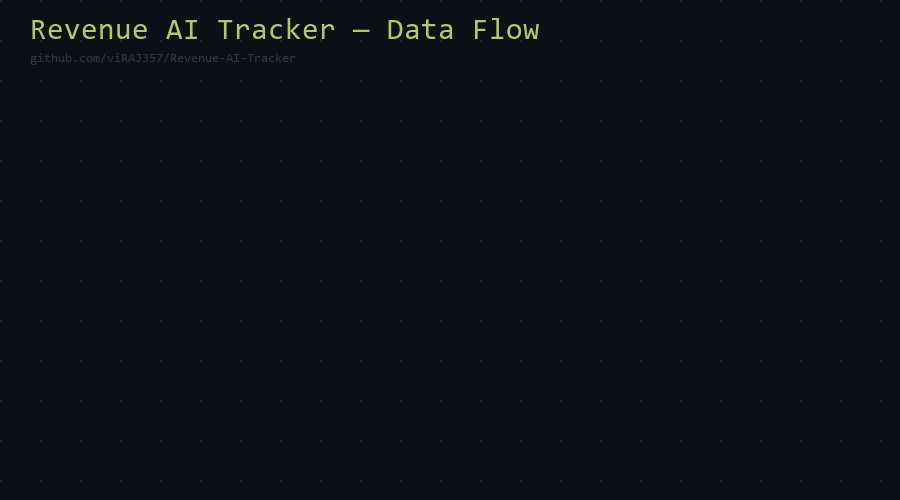
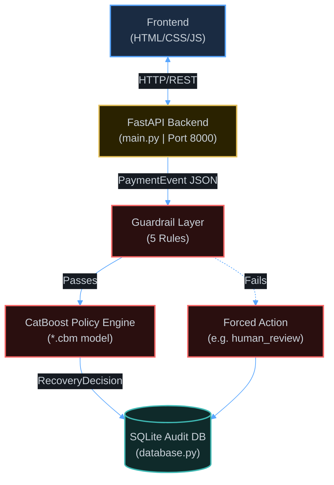
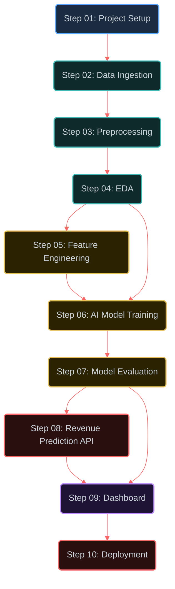
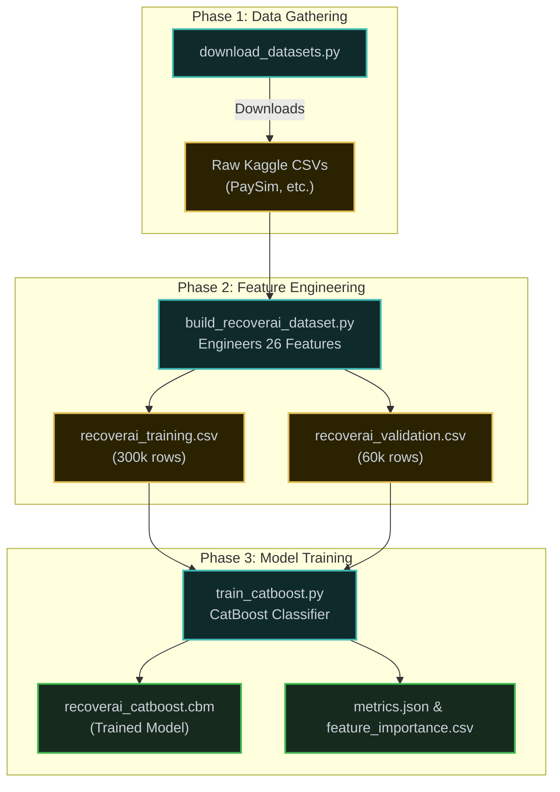

<div align="center">

<!-- Animated typing banner -->
<a href="https://github.com/viRAJ357/Revenue-AI-Tracker">
  
</a>


<p align="center">
  <a href="https://python.org"></a>
  <a href="https://fastapi.tiangolo.com"></a>
  <a href="https://catboost.ai"></a>
  
  
  <a href="LICENSE"></a>
</p>

<h3>An end-to-end AI system that predicts whether a failed financial transaction can be recovered — using CatBoost ML, FastAPI, and a live Operator Dashboard.</h3>

<br/>

<a href="index.html">
  
</a>

</div>


## 🎬 Motion Animation — Live Pipeline Flow

> Built from scratch using pure **Python + Pillow** — shows the full 10-step RecoverAI data pipeline animating in real time!

<div align="center">
  
</div>


## 📌 Table of Contents

- [Problem Statement](#-problem-statement)
- [System Architecture](#-system-architecture)
- [3D Interactive Flow Graph](#-3d-interactive-flow-graph)
- [Project Features](#-project-features)
- [ML Pipeline Workflow](#-ml-pipeline-workflow)
- [Project Structure](#-project-structure)
- [Quick Start Guide](#-quick-start-guide)
- [API Endpoints](#-api-endpoints)


## 🎯 Problem Statement

Every day, **millions of financial transactions fail** due to network errors, insufficient funds, or timeouts. Knowing exactly which transactions have a high probability of recovery can save businesses millions in lost revenue.

**RecoverAI** tackles this by predicting the likelihood of a transaction being successfully recovered within 72 hours, offering actionable recommendations like `Smart Retry`, `Delayed Retry`, or `Human Review`.

---

## 🏗️ System Architecture



## 📥 Input & 📤 Output Details

**Input (PaymentEvent JSON):** The API accepts a payload detailing the failed transaction — amount, merchant, customer history, previous failures, and device data.

**Output (RecoveryDecision):** The API responds with the recommended action (`smart_retry`, `human_review`, etc.), confidence probability (0.0–1.0), and guardrail flags.

---

## 🌀 3D Interactive Flow Graph

> Clone the repo and open **`index.html`** locally to experience the **n8n-style rotating 3D particle flow graph** connecting all pipeline nodes!



---

## ✨ Project Features

### 💻 Operator Dashboard (Frontend)
- Real-time monitoring of failed transactions.
- Beautiful, responsive UI to review "Human Review" cases.
- Analytics and graphs tracking recovery rates.

### 🛡️ Guardrail Engine & API
- **FastAPI** backend exposing REST endpoints for transaction processing.
- A **Guardrail Layer** that forces manual review for high-value or high-risk transactions before hitting the ML model.

### 🧠 Machine Learning Engine
- Uses **CatBoostClassifier** — natively handles categorical features without manual one-hot encoding.
- Incorporates early stopping with AUC-optimised evaluation.

---

## 🔬 ML Pipeline Workflow



---

## 📁 Project Structure

```text
Revenue-AI-Tracker/
│
├── 📄 README.md                      ← You are here
├── 🌀 index.html                     ← 3D n8n-style Interactive Flow Graph
├── 🎬 assets/flow_animation.gif      ← Custom Python-animated pipeline GIF
│
├── 📥 Step_01_Project_Overview_and_Setup/
├── 📦 Step_02_Data_Collection_and_Ingestion/
├── 🔧 Step_03_Data_Preprocessing_and_Cleaning/
├── 📊 Step_04_Exploratory_Data_Analysis/
├── ⚙️  Step_05_Feature_Engineering/
├── 🤖 Step_06_AI_Model_Training/
├── 📈 Step_07_Model_Evaluation_and_Tuning/
├── 🔌 Step_08_Revenue_Prediction_API/
├── 🖥️  Step_09_Dashboard_and_Visualization/
└── 🐳 Step_10_Deployment_and_Monitoring/
```

---

## ⚡ Quick Start Guide

### 1. Clone & Setup
```bash
git clone https://github.com/viRAJ357/Revenue-AI-Tracker.git
cd Revenue-AI-Tracker
pip install -r backend/requirements.txt
```

### 2. View the 3D Graph
Double-click **`index.html`** → experience the rotating n8n-style 3D flow graph!

### 3. Run the Full Application
```bash
python run.py
```
👉 Open **http://localhost:8000** in your browser.

---

## 🔌 API Endpoints

| Method | Endpoint | Description |
|--------|----------|-------------|
| `POST` | `/api/process-payment` | Core inference endpoint. Returns recovery decision. |
| `GET`  | `/api/dashboard-stats` | Aggregated metrics for the dashboard. |
| `GET`  | `/api/recent-events` | Fetches 50 most recent recovery attempts. |
| `POST` | `/api/approve-action` | Operator endpoint to approve/reject human_review cases. |
| `GET`  | `/api/health` | Health check for API and Model status. |

---

## 🧰 Tech Stack

| Layer | Technology |
|---|---|
| Language | Python 3.11+ |
| ML Engine | CatBoost Classifier |
| Data Processing | Pandas, NumPy |
| API Backend | FastAPI + Uvicorn |
| Database | SQLite (audit trail) |
| Dashboard | HTML / CSS / JS |
| Containerization | Docker |
| 3D Graph | 3d-force-graph.js |
| Animation | Python Pillow (custom) |

<div align="center">
  <br/>
  <b>Built with AI, motion, and Python — end to end.</b>
  <br/><i>RecoverAI — Turning failed transactions into recovered revenue.</i>
  <br/><br/>
  
</div>