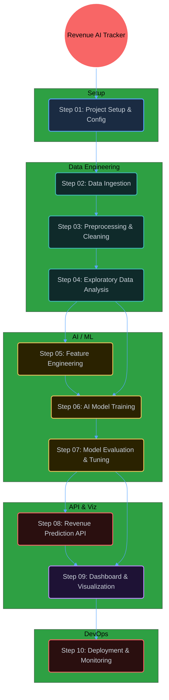

<div align="center">

<!-- Animated typing banner -->
<a href="https://github.com/viRAJ357/Revenue-AI-Tracker">
  
</a>


<p align="center">
  
  
  
  
  
  
</p>

<h3>An end-to-end AI-powered system to predict, track, and visualize business revenue — from raw data ingestion to live dashboard deployment.</h3>

<br/>

<a href="index.html">
  
</a>

</div>


## 🎬 Motion Animation — Live Data Pipeline Flow

> Built from scratch using pure **Python + Pillow**. Visualizes the entire 10-step Revenue AI pipeline flowing in real time!

<div align="center">
  
</div>


## 🌟 Full Architecture — 3D Interactive Graph

> Open `index.html` locally in any browser to explore the **advanced n8n-style 3D rotating graph** with particle flows connecting every step!




## 📂 Step-by-Step Breakdown

### 🔵 Phase 1 — Project Setup
- **`Step_01_Project_Overview_and_Setup/`**
  Environment setup, project configuration, dependency installation. Sets up Python virtual environments, installs required libraries (`pandas`, `sklearn`, `fastapi`, `plotly`), and defines the project configuration schema.

---

### 🟦 Phase 2 — Data Engineering

- **`Step_02_Data_Collection_and_Ingestion/`**
  Handles loading revenue data from CSV, databases, or APIs. Sets up ingestion pipelines and data validation checks to ensure data quality from the start.

- **`Step_03_Data_Preprocessing_and_Cleaning/`**
  Handles missing values, outlier detection, data type normalization, and feature scaling. Transforms raw, noisy data into a clean, structured format ready for analysis.

- **`Step_04_Exploratory_Data_Analysis/`**
  Deep statistical analysis using Pandas and Plotly. Generates correlation matrices, revenue trend charts, seasonal decomposition plots, and business KPI summaries.

---

### 🟡 Phase 3 — AI / Machine Learning

- **`Step_05_Feature_Engineering/`**
  Builds predictive features: lag features (revenue from past N months), rolling averages, seasonality flags, and external economic indicators.

- **`Step_06_AI_Model_Training/`**
  Trains multiple regression models: Linear Regression, Random Forest, XGBoost, and a stacked ensemble. Saves model artifacts using `joblib`.

- **`Step_07_Model_Evaluation_and_Tuning/`**
  Evaluates models using MAE, RMSE, R² metrics. Uses `GridSearchCV` and `RandomizedSearchCV` for hyperparameter tuning. Selects the best-performing model.

---

### 🔴 Phase 4 — API & Visualization

- **`Step_08_Revenue_Prediction_API/`**
  Serves the trained model as a REST API using **FastAPI**. Accepts business input features and returns revenue predictions with confidence intervals. Includes `/docs` Swagger UI.

- **`Step_09_Dashboard_and_Visualization/`**
  Interactive **Plotly Dash** dashboard displaying real-time revenue forecasts, trend analysis charts, model performance metrics, and business alerts.

---

### 🐳 Phase 5 — Deployment

- **`Step_10_Deployment_and_Monitoring/`**
  Containerizes the full stack (API + Dashboard) using **Docker** and `docker-compose`. Includes monitoring setup, health checks, and production deployment guides.


## 🚀 Quick Start

### 1. Clone the Repository
```bash
git clone https://github.com/viRAJ357/Revenue-AI-Tracker.git
cd Revenue-AI-Tracker
```

### 2. View the 3D Graph
Double-click **`index.html`** in any browser — experience the n8n-style rotating 3D flow graph!

### 3. Run the Revenue Prediction API
```bash
cd Step_08_Revenue_Prediction_API
pip install fastapi uvicorn scikit-learn pandas
uvicorn main:app --reload
```
Visit `http://127.0.0.1:8000/docs` for interactive Swagger UI.

### 4. Run via Docker
```bash
docker-compose up --build
```


## 🧰 Tech Stack

| Layer | Technology |
|---|---|
| Language | Python 3.10+ |
| Data Processing | Pandas, NumPy |
| Machine Learning | scikit-learn, XGBoost |
| API | FastAPI + Uvicorn |
| Visualization | Plotly, Dash |
| Containerization | Docker, docker-compose |
| 3D Graph | 3d-force-graph.js |
| Animation | Python Pillow (custom) |

<div align="center">
  <br/>
  <i>Built with AI, motion, and Python — end to end.</i>
  <br/><br/>
  
</div>
