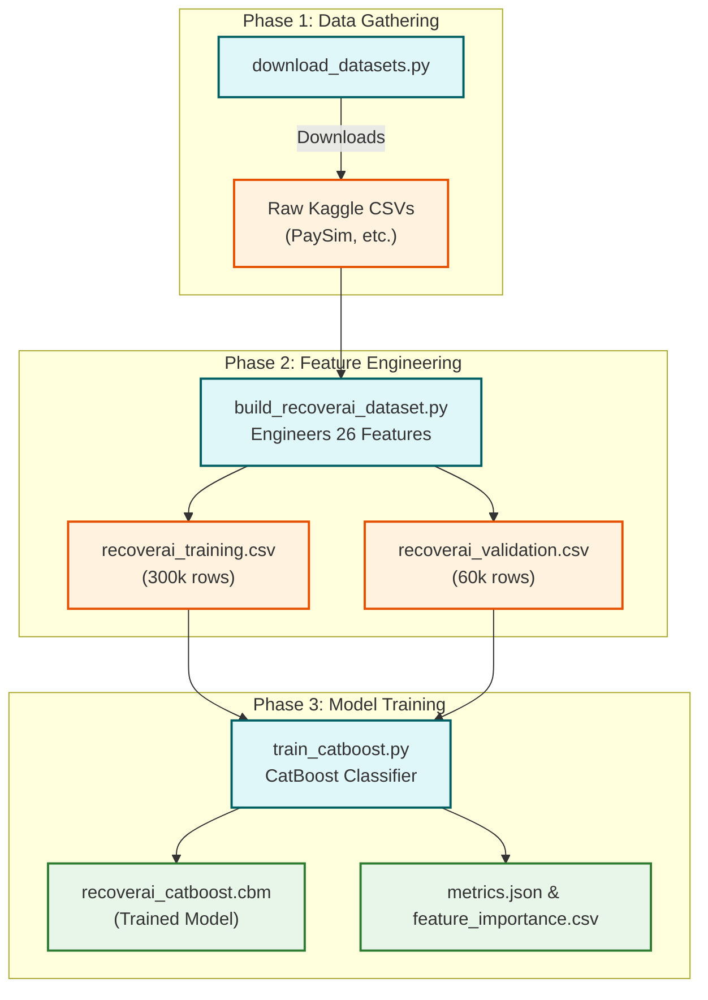

<div align="center">

# 🚀 RecoverAI — Intelligent Payment Recovery ML Pipeline

[](https://python.org)
[](https://catboost.ai)
[](https://pandas.pydata.org/)
[](LICENSE)

> **RecoverAI** is an end-to-end Machine Learning pipeline that predicts whether a failed financial transaction can be recovered. It generates a synthetic hybrid dataset from real Kaggle transactions and trains a robust CatBoost model.

---

</div>

## 📌 Table of Contents

- [Problem Statement](#-problem-statement)
- [Project Features](#-project-features)
- [ML Pipeline Workflow](#-ml-pipeline-workflow)
- [Data Engineering & Features](#-data-engineering--features)
- [Project Structure](#-project-structure)
- [Quick Start Guide](#-quick-start-guide)
- [Model Performance](#-model-performance)

---

## 🎯 Problem Statement

Every day, **millions of financial transactions fail** due to network errors, insufficient funds, or timeouts. Knowing exactly which transactions have a high probability of recovery can save businesses millions in lost revenue. 

**RecoverAI** tackles this by predicting — using a CatBoost model trained on 300,000 hybrid transactions — the likelihood of a transaction being successfully recovered within 72 hours.

---

## ✨ Project Features

### 🛠️ Hybrid Data Engineering
- Automatically downloads real-world data (PaySim, Financial Transactions, Credit Card Fraud) from Kaggle.
- Engineers a comprehensive 360,000-row dataset containing 26 carefully crafted features.
- Imputes missing categories, temporal patterns (hour, day, weekend), and customer behaviors.

### 🧠 Machine Learning Engine
- Uses **CatBoostClassifier** natively handling categorical features without the need for manual one-hot encoding.
- Incorporates early stopping with AUC-optimised evaluation.
- Outputs detailed evaluation metrics and feature importance rankings.

### 📊 Exploratory Data Analysis (EDA)
- Includes automated scripts (`eda_analysis.py`, `eda_fast.py`) to visualize the distributions of amounts, categorical balances, and recovery rates.

---

## 🔬 ML Pipeline Workflow



---

## 📈 Data Engineering & Features

The dataset builder script constructs 26 predictive features across 5 main categories:

| Category | Features |
|----------|---------|
| **Transaction** | `amount`, `payment_method`, `error_reason`, `card_type`, `merchant_category`, `amount_bucket` |
| **Customer** | `customer_segment`, `customer_age`, `account_balance`, `customer_tenure_months`, `previous_failed_attempts` |
| **Behaviour** | `retry_count`, `risk_score`, `recovery_attempt_count`, `transaction_frequency_30d`, `time_since_last_failure_hr` |
| **Context** | `bank`, `region`, `device_type`, `channel`, `hour_of_day`, `day_of_week`, `is_weekend` |
| **Notifications** | `notification_sent`, `opt_out_notification`, `treatment_action` |

**Target Variable:** `recovered_within_72h` (Binary Classification: 0 or 1).

---

## 📁 Project Structure

```text
Revenue-AI-Tracker/
│
├── 📄 README.md                      ← You are here
├── 📄 LICENSE                        ← MIT
├── 📄 .gitignore
│
├── 📥 download_datasets.py           ← Downloads Raw Kaggle CSVs
├── 🔧 build_recoverai_dataset.py     ← Builds engineered train/val datasets
├── 📊 eda_fast.py                    ← Fast terminal-based EDA
├── 📊 eda_analysis.py                ← Full EDA with graph visualisations
├── 🤖 train_catboost.py              ← Model training & evaluation script
├── 🚀 run_download.py                ← Wrapper to trigger dataset download
├── 🧪 ci_local_test.py               ← Local sanity testing script
│
├── 📄 requirements.txt (Optional)
└── ⚙️  docker-compose.yml             ← Environment setup
```

---

## ⚡ Quick Start Guide

Follow these steps to run the complete pipeline locally:

### 1. Setup Environment
```bash
git clone https://github.com/viRAJ357/Revenue-AI-Tracker.git
cd Revenue-AI-Tracker

# Install required python packages
pip install pandas numpy catboost scikit-learn
```

### 2. Download Kaggle Datasets
*(Note: Requires a valid `kaggle.json` token configured in `~/.kaggle/`)*
```bash
python download_datasets.py
```

### 3. Generate the Dataset
This will merge the raw datasets and engineer the 360,000-row output files.
```bash
python build_recoverai_dataset.py
```

### 4. Train the Model
Train the CatBoost model. Once completed, it will save `recoverai_catboost.cbm` and performance metrics.
```bash
python train_catboost.py
```

### 5. Run Exploratory Data Analysis
```bash
python eda_fast.py
```

---

## 📊 Model Performance (Expected)

*Actual performance may vary slightly based on random seed and dataset generation.*

| Metric | Target Score |
|--------|-------|
| 🎯 **Accuracy** | ~ **74.43%** |
| 📈 **AUC-ROC** | ~ **0.8207** |
| ✅ **Best Iteration** | Approx. 160-200 / 500 |
| 🗂️ **Training Rows** | 300,000 |
| 🧪 **Validation Rows** | 60,000 |
| 🔢 **Features** | 26 |

---

<div align="center">

**Built with ❤️**

*RecoverAI — Turning failed transactions into recovered revenue.*

</div>