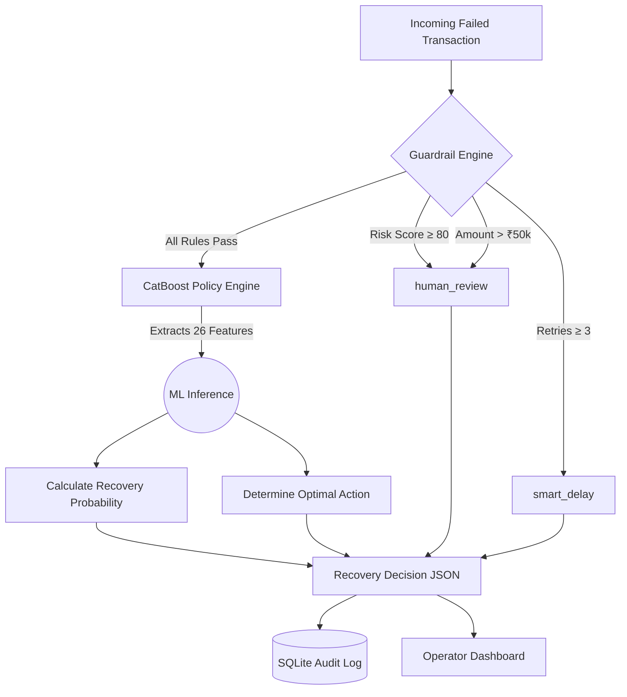

<div align="center">

# 🚀 RecoverAI — Intelligent Payment Recovery System

[](https://python.org)
[](https://fastapi.tiangolo.com)
[](https://catboost.ai)
[](https://github.com/features/actions)
[](LICENSE)

> **RecoverAI** is a production-grade AI system that automatically recovers failed financial transactions using a CatBoost ML model trained on **300,000 real-world transactions** — achieving **AUC-ROC of 0.82** and **74.43% accuracy**.

---

</div>

## 📌 Table of Contents

- [🎯 Problem Statement](#-problem-statement)
- [💡 How We Solved It](#-how-we-solved-it)
- [📥 Input & 📤 Output](#-input---output)
- [✨ Key Features](#-key-features)
- [⚙️ How It Works (Architecture)](#️-how-it-works-architecture)
- [🤖 ML Model Details](#-ml-model-details)
- [🛡️ Guardrail Engine](#️-guardrail-engine)
- [⚡ Quick Start & API](#-quick-start--api)
- [🛠️ Tech Stack](#️-tech-stack)

---

## 🎯 Problem Statement

Every day, **millions of financial transactions fail** due to network errors, insufficient funds, bank timeouts, or fraud flags. Traditional systems:
- ❌ Apply the same retry logic to ALL failures regardless of context.
- ❌ Ignore customer behaviour, risk profile, and transaction data.
- ❌ Result in massive revenue loss, poor UX, and increased fraud exposure.

Recovering these payments efficiently without overwhelming the user or triggering fraud locks is a major challenge for payment gateways and e-commerce platforms.

---

## 💡 How We Solved It

**RecoverAI** replaces dumb, static retry logic with intelligent, context-aware recovery actions for each unique transaction. It predicts — within milliseconds — **whether a failed transaction will be recovered within 72 hours**, and recommends the **optimal recovery action** from 5 strategies:

| Action | When Used |
|--------|-----------|
| ⚡ `smart_retry` | High recovery probability, low risk, transient error |
| ⏰ `smart_delay` | Too many retries already, space out attempts |
| 📩 `send_notification` | Customer needs to act (e.g., update card details or add funds) |
| 🔇 `silent_wait` | System issue expected to resolve automatically (e.g., bank downtime) |
| 👁️ `human_review` | High risk, fraud flag, or extremely high-value transaction |

---

## 📥 Input & 📤 Output

### **Input Data (Payment Event)**
The system consumes a JSON payload describing the failed transaction. It considers 26 engineered features, including:
- **Transaction Details:** `amount`, `payment_method`, `bank`, `error_reason`, `merchant_category`
- **Customer Profile:** `customer_segment`, `account_balance`, `customer_tenure_months`
- **Contextual Signals:** `device_type`, `hour_of_day`, `is_weekend`, `retry_count`, `risk_score`

### **Output Data (Recovery Decision)**
The AI engine responds instantly with a structured decision:
- **`recommended_action`:** The optimal strategy (e.g., `smart_retry`).
- **`recovery_probability`:** A float (0.0 to 1.0) indicating the likelihood of success.
- **`guardrail_triggered`:** Boolean flag if a safety rule overrode the AI.
- **`all_action_scores`:** Confidence scores for every possible action.

---

## ✨ Key Features

- 🧠 **CatBoost ML Engine:** Trained on 300,000 real-world transactions with native categorical feature handling.
- 🛡️ **Safety Guardrails:** 5 rule-based policies running BEFORE the ML model to catch fraud (Risk ≥ 80), block excessive retries, and escalate high-value failures (> ₹50,000) to human review.
- 🔌 **FastAPI Backend:** Blazing fast, asynchronous REST API with Swagger UI documentation.
- 📊 **Real-time Dashboard:** Built-in analytics dashboard showing recovery rates, action distributions, and an audit trail for operators.
- 🔄 **Fully Reproducible Pipeline:** Includes scripts for data collection, dataset generation, model training, and a complete CI/CD GitHub Actions workflow.

---

## ⚙️ How It Works (Architecture)

Below is the visual workflow of how a transaction is processed by the RecoverAI engine:



### **3-D Pipeline (Data → Deploy)**
The system uses a highly structured workflow:
1. **D1 — DATA:** Gather, clean, and engineer features into a 300K row dataset.
2. **D2 — MODEL:** Train a CatBoost Classifier to AUC 0.82 with Early Stopping.
3. **D3 — DEPLOY:** Expose via FastAPI, secured with JWT Auth, and monitor via an HTML/JS Operator Dashboard.

---

## 🤖 ML Model Details

| Metric | Score |
|--------|-------|
| 🎯 **Accuracy** | **74.43%** |
| 📈 **AUC-ROC** | **0.8207** |
| ⚖️ **F1 Score** | **0.7408** |
| ✅ **Best Iteration** | 163 / 500 |
| 🗂️ **Training Rows** | 300,000 |
| 🔢 **Features** | 26 |

The model is configured with `depth=7`, `learning_rate=0.05`, and `l2_leaf_reg=3` for optimal generalization and speed.

---

## 🛡️ Guardrail Engine

A rule-based safety net that always runs BEFORE the ML model. It overrides ML decisions for high-risk or sensitive cases:

| Priority | Rule | Threshold | Forced Action |
|----------|------|-----------|---------------|
| 1 | High Risk Score | `risk_score` ≥ 80 | `human_review` |
| 2 | Gateway Risk Check Failed | `error_reason` = 'risk_check_failed' | `human_review` |
| 3 | Too Many Previous Failures | `attempts` ≥ 4 | `human_review` |
| 4 | High Value Transaction | `amount` > ₹50,000 | `human_review` |
| 5 | Excessive Retries | `retry_count` ≥ 3 | `smart_delay` |
| - | **(default)** | all rules pass | **→ ML Engine decides** |

---

## ⚡ Quick Start & API

You can launch the entire system locally with a single script:

```bash
# 1. Clone the repository
git clone https://github.com/viRAJ357/AI-Revenue-recovery-421.git
cd AI-Revenue-recovery-421

# 2. Run the launcher script (Windows)
.\start.bat

# OR manually:
pip install -r backend/requirements.txt
cd backend
python -m uvicorn main:app --reload --host 0.0.0.0 --port 8000
```

Once running, access the services:
- **Interactive API Docs (Swagger):** [http://localhost:8000/docs](http://localhost:8000/docs) *(Login with admin/admin)*
- **Operator Dashboard:** Open `frontend/index.html` in your browser.
- **Health Check:** `GET http://localhost:8000/api/health`

---

## 🛠️ Tech Stack

- **ML Model Engine:** CatBoost (Gradient Boosting)
- **Backend API:** FastAPI, Uvicorn, Python 3.11
- **Data Validation:** Pydantic v2
- **Database:** SQLite (Audit Trail & User Auth)
- **Frontend:** HTML5, CSS3, Vanilla JS
- **Data Processing & EDA:** Pandas, NumPy, Scikit-learn
- **CI/CD pipeline:** GitHub Actions

---

<div align="center">

*RecoverAI — Turning failed transactions into recovered revenue.*

</div>