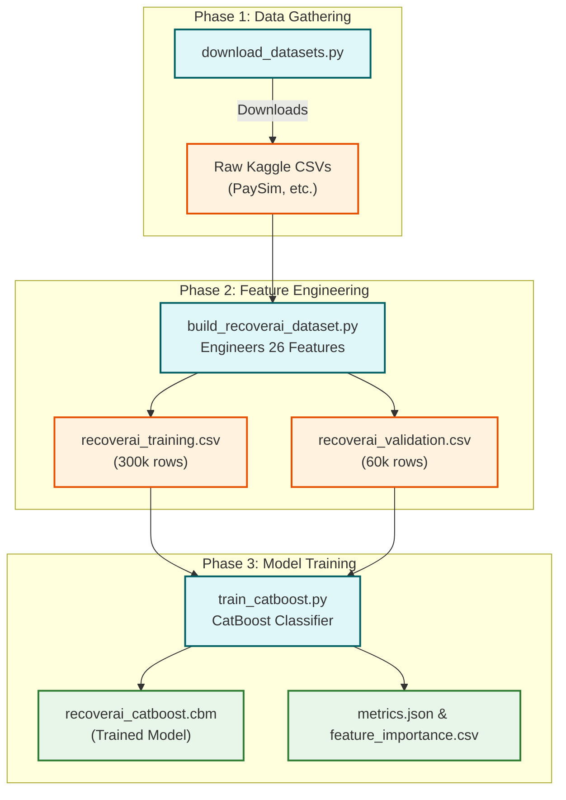

<div align="center">

# 🚀 RecoverAI — Intelligent Payment Recovery System

[](https://python.org)
[](https://fastapi.tiangolo.com)
[](https://catboost.ai)
[](LICENSE)

> **RecoverAI** is an end-to-end Machine Learning pipeline and interactive Operator Dashboard that predicts whether a failed financial transaction can be recovered. It uses a **CatBoost AI model** combined with a robust **FastAPI backend** and a beautiful frontend interface.

---

</div>

## 📌 Table of Contents

- [Problem Statement](#-problem-statement)
- [System Architecture](#-system-architecture)
- [Project Features](#-project-features)
- [ML Pipeline Workflow](#-ml-pipeline-workflow)
- [Project Structure](#-project-structure)
- [Quick Start Guide](#-quick-start-guide)
- [API Endpoints](#-api-endpoints)

---

## 🎯 Problem Statement

Every day, **millions of financial transactions fail** due to network errors, insufficient funds, or timeouts. Knowing exactly which transactions have a high probability of recovery can save businesses millions in lost revenue. 

**RecoverAI** tackles this by predicting the likelihood of a transaction being successfully recovered within 72 hours, offering actionable recommendations like `Smart Retry`, `Delayed Retry`, or `Human Review`.

---

## 🏗️ System Architecture

```mermaid
flowchart TD
    classDef ui fill:#e3f2fd,stroke:#1565c0,stroke-width:2px;
    classDef api fill:#fff8e1,stroke:#ff8f00,stroke-width:2px;
    classDef core fill:#ffebee,stroke:#c62828,stroke-width:2px;
    classDef db fill:#e8f5e9,stroke:#2e7d32,stroke-width:2px;

    UI["💻 Frontend<br>(HTML/CSS/JS)"]:::ui <-->|HTTP/REST| API["🔌 FastAPI Backend<br>(main.py | Port 8000)"]:::api
    
    API -->|PaymentEvent JSON<br>(Input)| GR["🛡️ Guardrail Layer<br>(5 Rules)"]:::core
    
    GR -->|Passes| ML["🧠 CatBoost Policy Engine<br>(*.cbm model)"]:::core
    GR -.->|Fails| Forced["🚨 Forced Action<br>(e.g. human_review)"]:::core
    
    ML -->|RecoveryDecision<br>(Output)| DB[("💾 SQLite Audit DB<br>(database.py)")]:::db
    Forced --> DB
```

## 📥 Input & 📤 Output Details

**Input (PaymentEvent JSON):** The API accepts a payload detailing the failed transaction, including amount, merchant, customer history, previous failures, and device data.  
**Output (RecoveryDecision):** The API responds with the recommended action (e.g., `smart_retry`, `human_review`), the confidence probability (0.0 to 1.0), and flags indicating if a guardrail triggered the decision.

---

## ✨ Project Features

### 💻 Operator Dashboard (Frontend)
- Real-time monitoring of failed transactions.
- Beautiful, responsive UI to review "Human Review" cases.
- Analytics and graphs tracking recovery rates.

### 🛡️ Guardrail Engine & API
- **FastAPI** backend exposing REST endpoints for transaction processing.
- A **Guardrail Layer** that forces manual review for high-value or high-risk transactions before hitting the ML model.

### 🧠 Machine Learning Engine
- Uses **CatBoostClassifier** natively handling categorical features without the need for manual one-hot encoding.
- Incorporates early stopping with AUC-optimised evaluation.

---

## 🔬 ML Pipeline Workflow



---

## 📁 Project Structure

```text
Revenue-AI-Tracker/
│
├── 📄 README.md                      ← You are here
├── 📄 LICENSE                        
│
├── 🔌 backend/                       ← FastAPI Server & SQLite DB
├── 🎨 frontend/                      ← HTML/JS/CSS Operator Dashboard
├── 🧠 model/                         ← Trained CatBoost models (*.cbm)
│
├── 📥 download_datasets.py           ← Downloads Raw Kaggle CSVs
├── 🔧 build_recoverai_dataset.py     ← Builds engineered train/val datasets
├── 📊 eda_analysis.py                ← Full EDA with graph visualisations
├── 🤖 train_catboost.py              ← Model training & evaluation script
├── 🚀 run.py                         ← Launcher Script
└── ⚙️  Dockerfile                     ← Docker Deployment config
```

---

## ⚡ Quick Start Guide

Follow these steps to run the complete pipeline locally:

### 1. Setup Environment
```bash
git clone https://github.com/viRAJ357/Revenue-AI-Tracker.git
cd Revenue-AI-Tracker

# Install required python packages
pip install -r backend/requirements.txt
```

### 2. Run the Full Application
This will start the FastAPI backend and automatically serve the interactive Dashboard on port 8000.
```bash
python run.py
```
👉 Open **http://localhost:8000** in your browser.

---

## 🔌 API Endpoints

| Method | Endpoint | Description |
|--------|----------|-------------|
| `POST` | `/api/process-payment` | Core inference endpoint. Receives transaction JSON and returns recovery decision. |
| `GET`  | `/api/dashboard-stats` | Aggregated metrics for the dashboard (recovery rate, pending reviews, etc.) |
| `GET`  | `/api/recent-events` | Fetches the 50 most recent recovery attempts from the audit DB. |
| `POST` | `/api/approve-action` | Operator endpoint to approve or reject a `human_review` case. |
| `GET`  | `/api/health` | Health check for the API and Model status. |

---

<div align="center">

**Built with ❤️**

*RecoverAI — Turning failed transactions into recovered revenue.*

</div>