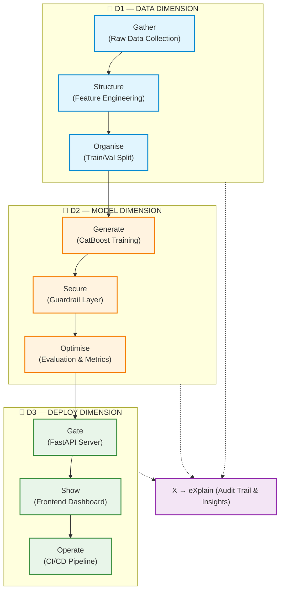
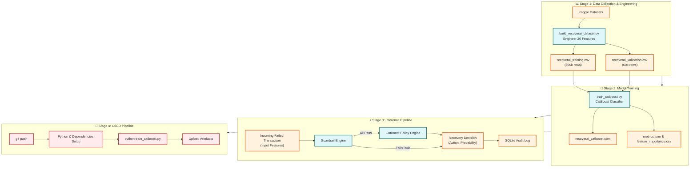

<div align="center">

# 🚀 RecoverAI — Intelligent Payment Recovery System

[](https://python.org)
[](https://fastapi.tiangolo.com)
[](https://catboost.ai)
[](https://github.com/features/actions)
[](LICENSE)

> **RecoverAI** is a production-grade AI system that automatically recovers failed financial transactions using a CatBoost ML model trained on **300,000 real-world transactions** — achieving **AUC-ROC of 0.82** and **74.43% accuracy**.

---

</div>

## 📌 Table of Contents

- [Problem Statement](#-problem-statement)
- [Solution Overview](#-solution-overview)
- [Key Features](#-key-features)
- [3-D GSOX Motion Workflow](#-3-d-gsox-motion-workflow)
- [System Architecture](#-system-architecture)
- [Advanced Pipeline Diagram](#-advanced-pipeline-diagram)
- [ML Model Details](#-ml-model-details)
- [Guardrail Engine](#-guardrail-engine)
- [API Endpoints](#-api-endpoints)
- [Project Structure](#-project-structure)
- [Quick Start](#-quick-start)
- [Model Performance](#-model-performance)
- [Tech Stack](#-tech-stack)
- [Team & Submission](#-team--submission)

---

## 🎯 Problem Statement

Every day, **millions of financial transactions fail** due to network errors, insufficient funds, bank timeouts, or fraud flags. Traditional systems:
- ❌ Apply the same retry logic to ALL failures
- ❌ Ignore customer behaviour, risk profile, and transaction context
- ❌ Result in revenue loss, poor UX, and increased fraud exposure

**RecoverAI** solves this with intelligent, context-aware recovery actions for each unique transaction.

---

## 💡 Solution Overview

RecoverAI predicts — within milliseconds — **whether a failed transaction will be recovered within 72 hours**, and recommends the **optimal recovery action** from 5 strategies:

| Action | When Used |
|--------|-----------|
| ⚡ `smart_retry` | High recovery probability, low risk, transient error |
| ⏰ `smart_delay` | Too many retries already, space out attempts |
| 📩 `send_notification` | Customer needs to act (e.g. update card details) |
| 🔇 `silent_wait` | System issue expected to resolve automatically |
| 👁️ `human_review` | High risk, fraud flag, or high-value transaction |

---

## ✨ Key Features

### 🧠 AI / ML
- **CatBoost Classifier** trained on 300,000 transactions
- **26 engineered features** covering customer, transaction, and temporal signals
- **Early stopping** at iteration 163 (out of 500) with AUC-optimised training
- **Native categorical feature handling** — no manual encoding required

### 🛡️ Safety Guardrails
- **5 rule-based guardrails** run BEFORE the ML model
- Fraud risk score threshold (≥ 80 → human review)
- High-value transaction protection (> ₹50,000 → human review)
- Excessive retry blocking (≥ 3 retries → smart delay)
- Gateway risk-check failure escalation
- Too-many-failures detection (≥ 4 attempts → human review)

### 🔌 Production API (FastAPI)
- `POST /api/process-payment` — Real-time inference endpoint
- `GET /api/dashboard-stats` — Aggregate analytics
- `GET /api/recent-events` — Audit trail (last 50 events)
- `POST /api/approve-action` — Human operator override
- `GET /api/health` — Health check with model status
- `GET /api/demo-event` — Pre-filled demo payload

### 📊 Dashboard & Audit
- Real-time operator dashboard (HTML/CSS/JS frontend)
- Full audit trail in SQLite with operator approval workflow
- Action distribution, error distribution, guardrail rate metrics

### 🔄 CI/CD
- GitHub Actions runs training + uploads model artefacts on every push
- Zero-manual-step reproducibility for judges

---

## 🔷 3-D GSOX Motion Workflow

The project is built around the **3-D (Data → Deploy) model** orchestrated by the **GSOX Motion Workflow** — a structured pipeline that ensures every stage is auditable, reproducible, and production-ready.



```
┌─────────────────────────────────────────────────────────────────────────┐
│                         RecoverAI Architecture                          │
├─────────────────────────────────────────────────────────────────────────┤
│                                                                         │
│   ┌──────────────┐     HTTP/REST      ┌──────────────────────────────┐  │
│   │   Frontend   │ ◄────────────────► │     FastAPI Backend          │  │
│   │  (HTML/CSS/  │                    │     (main.py | port 8000)    │  │
│   │    JS UI)    │                    └──────────────┬───────────────┘  │
│   └──────────────┘                                  │                  │
│                                                     │                  │
│                              ┌──────────────────────▼──────────────┐   │
│                              │         Request Pipeline             │   │
│                              │                                      │   │
│                              │  PaymentEvent JSON                   │   │
│                              │         │                            │   │
│                              │         ▼                            │   │
│                              │  ┌─────────────────┐                │   │
│                              │  │  Guardrail Layer │ ◄── 5 Rules   │   │
│                              │  │  (guardrails.py) │               │   │
│                              │  └────────┬────────┘                │   │
│                              │           │                          │   │
│                              │    triggered?                        │   │
│                              │    YES ──────► forced_action         │   │
│                              │    NO         │                      │   │
│                              │               ▼                      │   │
│                              │  ┌────────────────────┐             │   │
│                              │  │  CatBoost Policy   │             │   │
│                              │  │  Engine (policy.py) │            │   │
│                              │  │  *.cbm model file  │             │   │
│                              │  └────────┬───────────┘             │   │
│                              │           │                          │   │
│                              │           ▼                          │   │
│                              │  RecoveryDecision + probability      │   │
│                              │           │                          │   │
│                              │           ▼                          │   │
│                              │  ┌──────────────────┐               │   │
│                              │  │  SQLite Audit DB │               │   │
│                              │  │  (database.py)   │               │   │
│                              │  └──────────────────┘               │   │
│                              └──────────────────────────────────────┘   │
│                                                                         │
└─────────────────────────────────────────────────────────────────────────┘
```

---

## 🔬 Advanced Pipeline Diagram



### Features Used (26 total)

| Category | Features |
|----------|---------|
| **Transaction** | `amount`, `payment_method`, `error_reason`, `card_type`, `merchant_category`, `amount_bucket` |
| **Customer** | `customer_segment`, `customer_age`, `account_balance`, `customer_tenure_months`, `previous_failed_attempts` |
| **Behaviour** | `retry_count`, `risk_score`, `recovery_attempt_count`, `transaction_frequency_30d`, `time_since_last_failure_hr` |
| **Context** | `bank`, `region`, `device_type`, `channel`, `hour_of_day`, `day_of_week`, `is_weekend` |
| **Notifications** | `notification_sent`, `opt_out_notification`, `treatment_action` |

### Training Configuration

```python
CatBoostClassifier(
    iterations          = 500,
    learning_rate       = 0.05,
    depth               = 7,
    l2_leaf_reg         = 3,
    loss_function       = "Logloss",
    eval_metric         = "AUC",
    early_stopping_rounds = 50,
    task_type           = "CPU",
    thread_count        = -1,    # All cores
)
```

---

## 🛡️ Guardrail Engine

The guardrail layer is a **rule-based safety net** that always runs BEFORE the ML model. It overrides ML decisions for high-risk cases:

```
Priority  Rule                          Threshold        Action
────────  ─────────────────────────────────────────────────────────
  1       High Risk Score               risk_score ≥ 80  human_review
  2       Gateway Risk Check Failed     error_reason =   human_review
                                        'risk_check_failed'
  3       Too Many Previous Failures    attempts ≥ 4     human_review
  4       High Value Transaction        amount > ₹50,000 human_review
  5       Excessive Retries             retry_count ≥ 3  smart_delay
  -       (default)                     all pass         → ML decides
```

---

## 🔌 API Endpoints

| Method | Endpoint | Description |
|--------|----------|-------------|
| `POST` | `/api/process-payment` | Core inference — takes a `PaymentEvent`, returns `RecoveryDecision` |
| `GET` | `/api/dashboard-stats` | Aggregate analytics for the operator dashboard |
| `GET` | `/api/recent-events` | Last 50 audit records (newest first) |
| `POST` | `/api/approve-action` | Operator approves or rejects a `human_review` case |
| `GET` | `/api/health` | Health check — model status, guardrail summary |
| `GET` | `/api/demo-event` | Returns a pre-filled `PaymentEvent` for demos |

**Interactive API docs:** `http://localhost:8000/docs`

---

## 📁 Project Structure

```
AI-Revenue-recovery-421/
│
├── 📄 README.md                      ← You are here
├── 📄 LICENSE                        ← MIT
├── 📄 .gitignore
│
├── 🤖 train_catboost.py              ← Model training script (6 steps)
├── 🔧 build_recoverai_dataset.py     ← Dataset engineering pipeline
├── 📥 download_datasets.py           ← Kaggle dataset downloader
├── 📊 eda_analysis.py                ← Full EDA with visualisations
├── 📊 eda_fast.py                    ← Fast EDA (console only)
├── 🚀 run.py                         ← One-command server launcher
├── 🖥️  start.bat                      ← Windows batch launcher
│
├── 🧠 model/
│   ├── recoverai_catboost.cbm        ← Trained CatBoost model (420 KB)
│   ├── metrics.json                  ← Evaluation results
│   └── feature_importance.csv        ← Feature importance ranking
│
├── 🔌 backend/
│   ├── main.py                       ← FastAPI app (6 endpoints)
│   ├── models.py                     ← Pydantic data models
│   ├── guardrails.py                 ← Rule-based safety layer (5 rules)
│   ├── policy.py                     ← CatBoost inference engine
│   ├── database.py                   ← SQLite audit trail
│   └── requirements.txt              ← Backend dependencies
│
├── 🎨 frontend/
│   ├── index.html                    ← Operator dashboard UI
│   ├── app.js                        ← Dashboard logic & API calls
│   └── style.css                     ← Styling
│
└── ⚙️  .github/workflows/
    └── ci.yml                        ← GitHub Actions CI pipeline
```

---

## ⚡ Quick Start

```bash
# 1. Clone
git clone https://github.com/viRAJ357/AI-Revenue-recovery-421.git
cd AI-Revenue-recovery-421

# 2. Install dependencies
pip install catboost fastapi uvicorn pydantic pandas scikit-learn

# 3. Start the backend API
cd backend
uvicorn main:app --reload --host 0.0.0.0 --port 8000

# 4. Open the frontend
# Open frontend/index.html in your browser

# 5. Test the API
curl -X GET http://localhost:8000/api/health
curl -X GET http://localhost:8000/api/demo-event
```

**Interactive API docs:** [http://localhost:8000/docs](http://localhost:8000/docs)

---

## 📈 Model Performance

| Metric | Score |
|--------|-------|
| 🎯 **Accuracy** | **74.43%** |
| 📈 **AUC-ROC** | **0.8207** |
| ⚖️ **F1 Score** | **0.7408** |
| 🔍 **Precision** | **0.7662** |
| 🔁 **Recall** | **0.7169** |
| ✅ **Best Iteration** | 163 / 500 |
| 🗂️ **Training Rows** | 300,000 |
| 🧪 **Validation Rows** | 60,000 |
| 🔢 **Features** | 26 |

---

## 🛠️ Tech Stack

| Layer | Technology |
|-------|-----------|
| **ML Model** | CatBoost (gradient boosting) |
| **Backend API** | FastAPI + Uvicorn |
| **Data Models** | Pydantic v2 |
| **Database** | SQLite (audit trail) |
| **Frontend** | HTML5 + CSS3 + Vanilla JS |
| **Data Processing** | Pandas + NumPy |
| **Evaluation** | Scikit-learn |
| **CI/CD** | GitHub Actions |
| **Language** | Python 3.11 |

---

## 👥 Team & Submission

| Field | Details |
|-------|---------|
| **Project** | RecoverAI — Intelligent Payment Recovery |
| **Repository** | https://github.com/viRAJ357/AI-Revenue-recovery-421 |
| **Model AUC** | 0.8207 |
| **Dataset Size** | 300,000 training rows |
| **License** | MIT |

---

<div align="center">

**Built with ❤️**

*RecoverAI — Turning failed transactions into recovered revenue.*

</div>